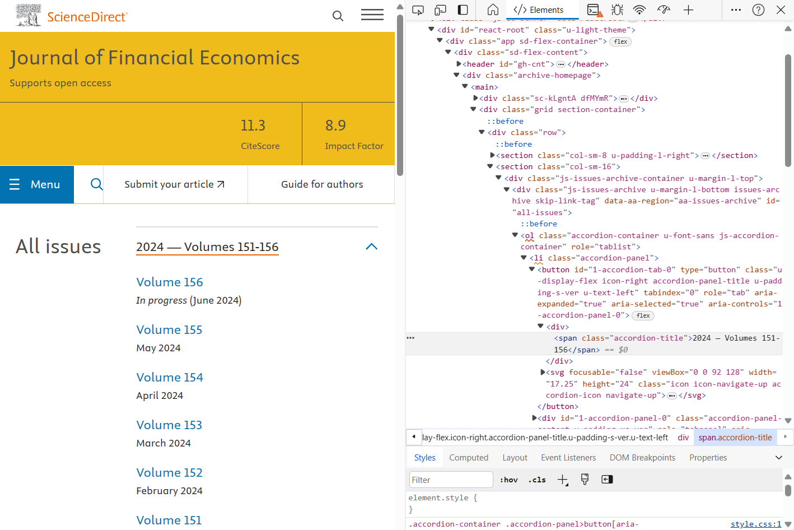
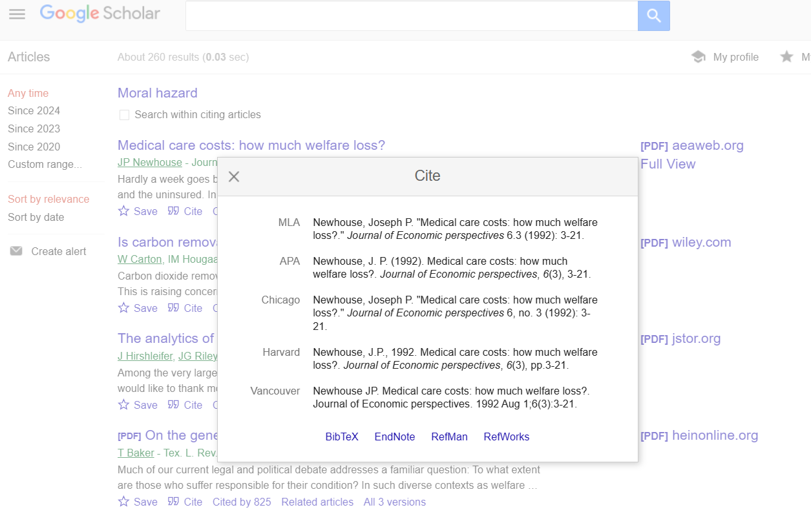

# Web-scraping citations data and constructing a citation network 

We build a web-scraping program to collect publication data of papers published on the Journal of Financial Economics (JFE) for the past 15 years and the citation data of papers that cite these JFE papers on Google Scholar. 

First, our web-scraping program collects the citation data parsing by parsing through the html code of the websites that contain the information of our interest. 

   
    &nbsp; &nbsp; &nbsp; &nbsp;
  

   
Then, we build the citation network where the nodes are the cited JFE papers and the Google Scholar citing papers and the edges are paper-to-paper citations. 

Using the HoloViz package, we visualize our citation network. Drawing our network allows us to visually spot significant papers based on their connectivity in the network. 

Full view of the citation network:

   

Zooming in on a region of nodes, we can visually identify high-degree nodes and low-degree nodes (i.e. we can distinguish the papers that are cited more than others). 

   

Further zooming in on a few nodes, we observe the local graph structure of specific nodes.

   

<!--
Images side by side

   
&nbsp; &nbsp; &nbsp; &nbsp;
  

-->