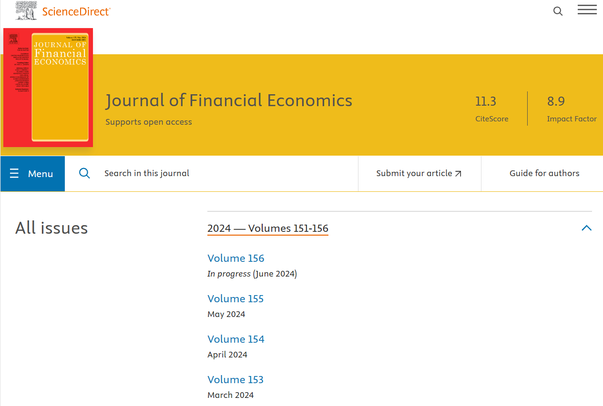
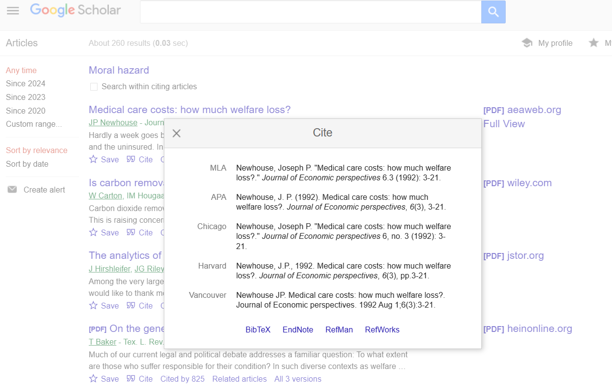

# Web-scraping citations data and constructing a citation network 

We build a web-scraping program to collect publication data of papers published on the Journal of Financial Economics (JFE) for the past 20 years and the citation data of papers that cite these JFE papers on Google Scholar. 

   
&nbsp; &nbsp; &nbsp; &nbsp;
  

